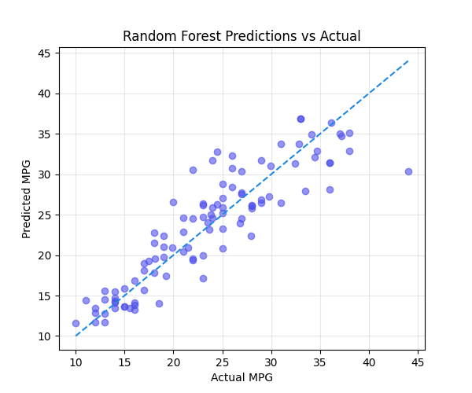
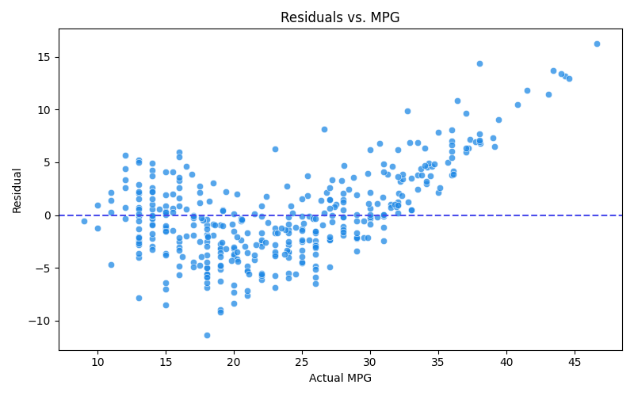

# Pipeline Playbook

The Pipeline Playbook documents a full data-science workflow so visitors can follow the lifecycle: ingestion → exploration → modeling → presentation. Each folder pairs code with narrative context so the repo feels like a readable case study.

## Structure

- `data/raw/` — archived snapshots of the original datasets.
- `data/processed/` — clean, analysis-ready tables for modeling or visualization, including one-hot encoded and derived predictors.
- `src/` — reusable scripts (ingestion, wrangling, modeling).
- `reports/` — Markdown summaries, feature notes, model metrics, and presentation artifacts.
- `notebooks/` — optional exploratory notebooks and drafts.
- `docs/` — plans, iteration notes, automation docs, presentation instructions, and the upcoming sprint schedule (`docs/schedule.md`).
- `presentation_app.py` — lightweight Streamlit interface for exploring predictions, diagnostics, and scenarios.

## Streamlit Explorer usability review (Sprint 2026-02-01)
The Streamlit interface is intentionally lightweight and focuses on making the pipeline story accessible:

- **Model switcher + data preview** — the sidebar lets stakeholders pick between the linear regression and Random Forest artifacts while peeking at the median-feature sample so they can orient themselves without digging into the data folder.
- **Scenario builder** — the interactive form starts with medians, supports rapid tuning of engineered predictors, and responds with an instantly updated `st.metric`, which makes it intuitive to compare how each input moves MPG predictions.
- **Diagnostics gallery** — the carousel-style diagnostics section pulls in the saved residuals and prediction snapshots (`reports/figures/`), which keeps the narrative connected to the documented training runs without rebuilding the charts inside the app.
- **Narrative recap** — the lower section restates the highlight bullets from the Markdown presentation, reinforcing the ingestion → modeling → diagnostics storyline for anyone who lands on the Streamlit interface.

### Summary screenshots

*Figure 1: The diagnostics gallery doubles as a quick sanity check for model output, showing the Random Forest prediction distribution that the user can compare against the Linear Regression pane.*

*Figure 2: Residual checks surface immediately below the scenario builder, so stakeholders can keep an eye on modeling stability while exploring different feature combinations.*

## Current Pipeline Focus
1. **Data ingestion** — `data/raw/mpg.csv` is sourced from the Seaborn collection and snapshot locally.
2. **Exploration** — `reports/initial-eda.md` narrates the distributional profile and missingness checks.
3. **Modeling** — Baseline regression + Random Forest trained on engineered predictors; results recorded in `reports/modeling-summary.md`.
4. **Diagnostics** — Residual analysis lives in `reports/residuals.md` and the accompanying figure (`reports/figures/residuals.png`).
5. **Diagnostics** — Residual analysis lives in `reports/residuals.md` and `reports/figures/residuals.png`.
6. **Interpretability** — `reports/interpretability.md` summarizes permutation importance across the linear regression and Random Forest models, with charts in `reports/figures/`.
7. **Presentation** — `reports/presentation.md` synthesizes the full workflow, showcases the plots, and calls out next steps.

## Upcoming work
- Residual checks and figure export (reports/figures/)
- Expanded feature engineering for a stronger baseline
- Drafting a presentation-friendly README section that ties the story to business impact

More concise updates will be captured in the `docs/plan.md` notes as the story evolves.
